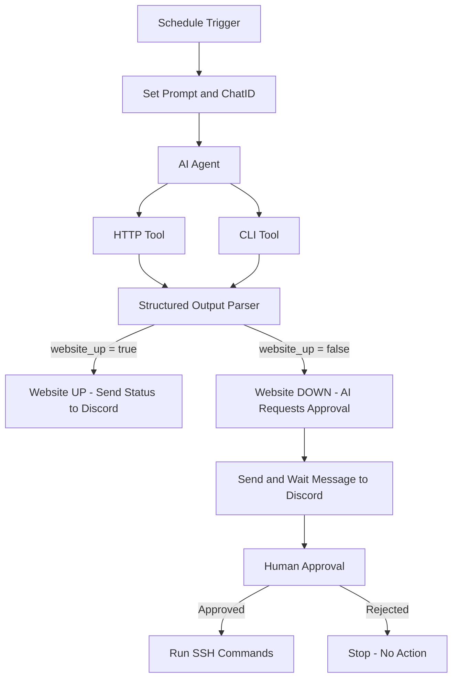

# 🚀 Automated Website Monitoring & Self-Healing System (n8n + AI Agent + Discord + SSH)

This project is an **AI-powered automated troubleshooting system** built using **n8n**, **Google Gemini LLM**, **Discord**, and **SSH**.
It continuously monitors a website, diagnoses issues, asks for approval before risky fixes, and applies server-side corrections when authorized.

---

## 🔍 Overview

The system checks the target website (**[http://10.62.17.132:8090](http://10.62.17.132:8090)**) at regular intervals.
If the site is **UP**, it sends a healthy status message.
If **DOWN**, the AI:

1. Investigates root cause
2. Proposes a fix
3. Requests approval through Discord
4. Runs SSH commands only after approval

This ensures **safety**, **autonomy**, and **real-time monitoring**.

---

## 🧠 Key Features

### ✅ Automated Website Monitoring

Uses a scheduled workflow to regularly check site availability.

### ✅ AI-Driven Troubleshooting

A custom agent ("Friday") uses Google Gemini to:

* Check if the webpage contains required HTML
* Diagnose Docker issues
* Detect port conflicts (lsof, ps, etc.)
* Identify container crashes

### 🚨 Safety Layer (Human-in-the-Loop)

AI **cannot** execute system-altering commands without explicit approval:

* docker start/stop/restart
* kill/pkill
* systemctl
* file edit/delete

### 💬 Discord Integration

All critical events are sent to Discord:

* Status updates
* Issues detected
* Approval requests

### 🖥️ SSH Automation

If approved, n8n executes the fix via SSH using a sub-workflow.

---

## 🧩 System Flow (Mermaid Diagram)



---

## 🏗️ Workflow Components

### **1. Schedule Trigger**

Runs every few minutes to start the monitoring cycle.

### **2. Prompt Builder**

Adds:

* System prompt
* Chat session ID

### **3. AI Agent (Gemini)**

Performs:

* Website check
* Diagnostics
* Error analysis
* JSON-format result
* Approval request generation

### **4. Tools**

#### HTTP Tool

Verifies the website’s HTML response.

#### CLI Tool

Allows safe commands:

* `docker ps`
* `lsof -i :8090`
* `ps aux`

### **5. Structured Output Parser**

Ensures AI returns valid JSON:

```json
{
  "website_up": true,
  "message": "...",
  "applied_fix": false,
  "needs_approval": false,
  "commands_requested": null
}
```

### **6. Discord Alert System**

Two modes:

* Status notification
* Approval-required message (waits for reply)

### **7. SSH Sub-Workflow**

Executes approved commands such as:

* `docker start website`
* `kill <PID>`
* Restarting services

---

## 🛠️ Installation & Setup

### **Requirements**

* n8n instance running
* Google Gemini API key
* Discord Bot + channel
* SSH access to your server
* Docker installed on the server

---

### **Import Workflows**

1. Import `troubleshooter.json`
2. Import `call SSH_n8n_server.json`

---

### **Configure Credentials**

Inside n8n:

| Purpose       | Credential         |
| ------------- | ------------------ |
| AI            | Google Gemini API  |
| Server access | SSH Password / Key |
| Alerts        | Discord Bot Token  |

---

## 🧪 How It Works

### ✔️ **When Website Is UP**

* AI confirms HTML signature
* Logs status
* Sends Discord "all good" message

### ❌ **When Website Is DOWN**

AI performs deep troubleshooting:

* Check Docker container state
* Detect port binding issues
* Find PIDs using port 8090
* Proposes exact commands

Then:

1. Sends approval request to Discord
2. Waits for human response
3. Runs SSH commands **only if approved**

---

## 🔒 Security Model

* AI cannot directly execute destructive commands
* All high-risk actions flow through Discord approval
* SSH commands are logged
* Workflow prevents accidental or unauthorized actions

---

## 📈 Future Enhancements

* Auto retry before requesting human approval
* Multi-endpoint monitoring
* AI-powered anomaly detection
* Email notifications
* Log-based recovery strategies


Just tell me!
